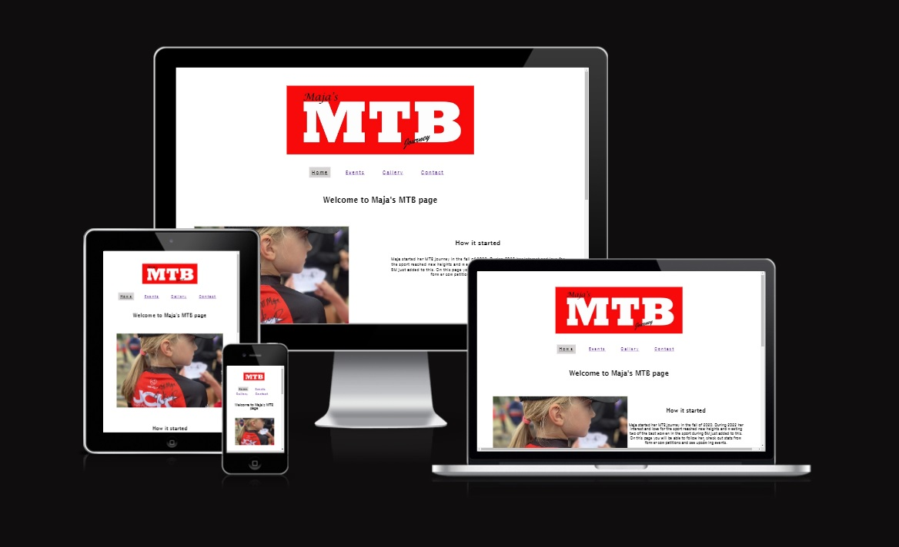
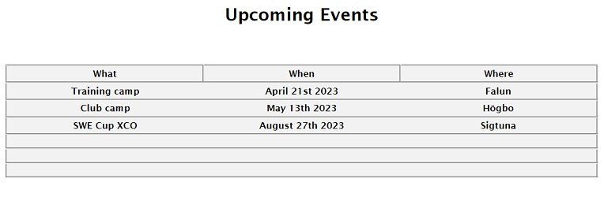
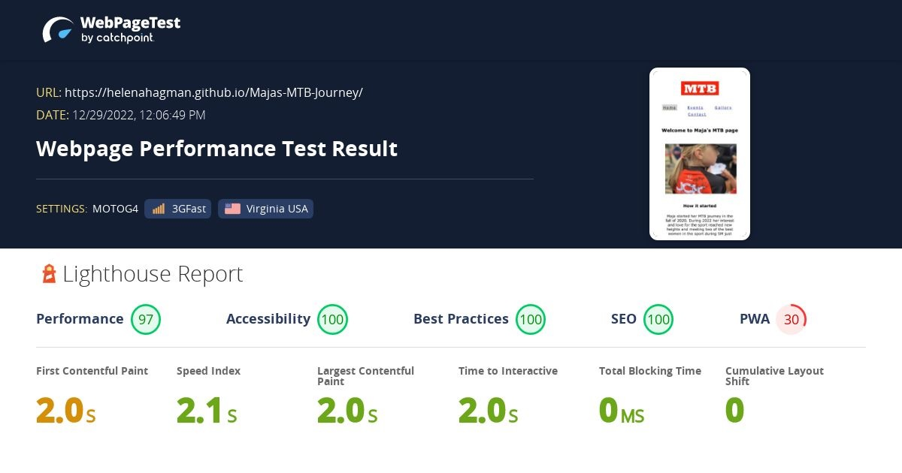

<a href="index.html">
        
 
        

     </a>

 
<h1>Majas Mountainbike Page</h1>

<h2>Description</h2>
 

This page lets the user follow Maja on her MTB adventures. The user will be able to see when and where upcoming events, such as camps and competitions, will take place. It will also provide the user with a gallery and the possibility to make contact as well as a link to instagram.

 

   

 
<h2>Features</h2>
 
<h3>Navigation</h3>
<ul>
  <li>The custom made logo in the header makes it easy to see what the page is about</li>
  <li>Menu with clickable links, hoover funktion and a clear visual indication on current page for easy site navigation in the header of all pages</li>
     
  
   
   
  <li>Instagram link with hoover function in the footer of all pages</li>
   

 <h3>Index page</h3> 
  
  <li>Short information on what the page is about and a short introduction on who Maja is and two photos of Maja in.</li> 
  

 <h3>Events page</h3> 
   
  <li>Calendar with information on upcoming events</li>
   
  
   
   
  <li>Contact form with email link and hoover function on send button</li>
   
  
<h3>Gallery page</h3> 
   
  <li>Gallery images with hoover funtion for the user to visually see what image they point at.</li>
   

<h3>Contact</h3>
   
  <li>Direct link to events page and the Contact form section. The form lets the user fill in name, email address and notes, when klicking on the send button a prefilled email will open and the user can send the email</li>
   
  
   
</ul>
   

<h2>Testing</h2>
   
 <ul>
  <li>I tested and confirmed that the site is responsive and looks good on diffrent screen sizes using the devtools device toolbar and Lighthouse.</li>
   
  

   
        

   
  <li>I tested and confirmed that the navigation, contact form, and klickable links are working and readable.</li>
  <li>I tested and confirmed that the form works, name and email feilds requires entries, the email field only accepts en email address and the submit button works.</li>
   </ul>
 
<h2>Bugs</h2>
   
  <ul>
  <li>No larger bugs found.</li>
  <li>Email entry field accepted all entries - fixed   The code was missing the type="email", after adding this the field only accepts emails as entries.</li></ul>
 
<h2>Badges</h2>
   
  <ul>
  <li>CSS validation complete with no errors</li>
   
  

    
  

   
  <li>HTML validation complete with no errors</li>
  </ul>
   

<h2>Unfixed Bugs</h2>
   
  <ul>
  <li>No unfixed bugs</li>
  </ul>
   

<h2>Support</h2>
   
  
Useful links for validation and help:

  <ul>
   <li>https://www.w3schools.com/</li>
   <li>https://fonts.google.com/</li>
   <li>https://validator.w3.org/</li>
   <li>https://jigsaw.w3.org/css-validator/</li>
   <li>https://www.webpagetest.org/</li>
   <li>https://ui.dev/amiresponsive</li>

  </ul>
   
<h2>Future releases</h2>
   
  
No plan available at the moment

 <ul>
  <li>Informaiton with statistics and results</li>
  <li>Cooperation with JCK club website</li>
  <li>Link to competitions that livestream their events</li>
 </ul>
   

<h2>Acknowledgments</h2>
   
  
Special thanks to:

 <ul>
  <li>My Mentor Jubril Akolade for input and useful tips.</li>
  <li>Magnus Holst Fernsten for help with the Gallery page, specifically the col- and the @media queries related to that when I couldnt get the right responsivity on smaller screens for the images. ( SHA codes: e73e2802c6db33a90653de160fe262c66bf0a875, e0237a06b3eacc9a4b3e014d98d1d7ed13428cea )
   
  
Updated: class="responsive" to class="col-3" on images in gallery html page  Updated @media queries: Commented out query for min-width: 1250px, added .col-6 and .col-3 width 50% to max-width: 1250px, added .col-3 width 100% to max-width: 750px</li>
  

  <li>https://www.w3schools.com/ have been used for several smaller adjustments and especially the col inputs</li>
  <li>https://fonts.google.com/</li>
 </ul>
   

<h2>Deployment</h2>
   
<ul>
  <li>The site was deployed to GitHub pages, following the steps from the Love Running Project.</li>
</ul>
<h3>Live site</h3>
   
 
https://helenahagman.github.io/Majas-MTB-Journey/
