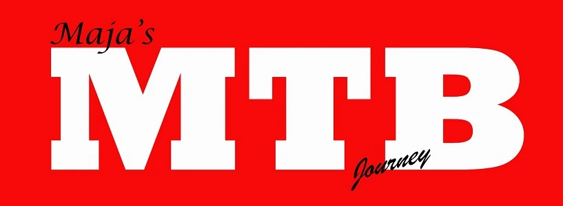
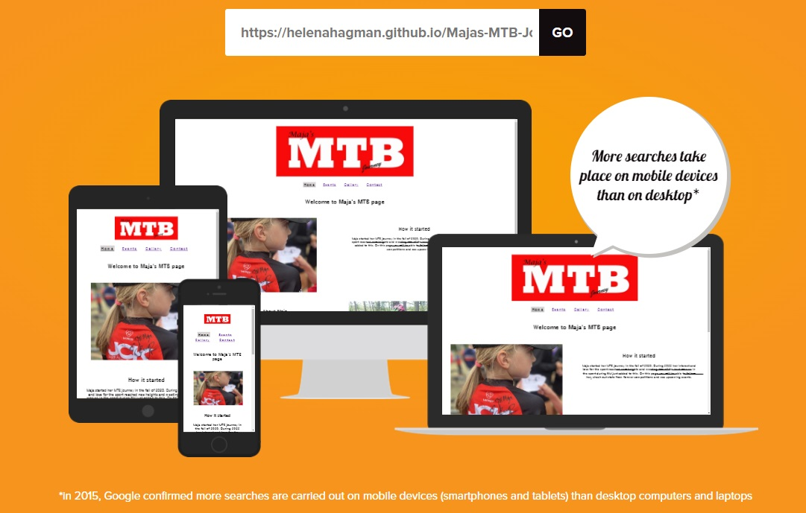
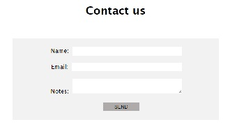
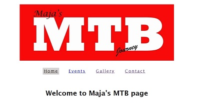
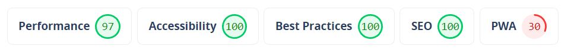

<a href="index.html">
        
 
        

     </a>

 
<h1>Majas Mountainbike Page</h1>

<h2>Description</h2>
 

This page lets the user follow Maja on her MTB adventures. The user will be able to see when and where upcoming events, such as camps and competitions, will take place. It will also provide the user with a gallery and the possibility to make contact as well as a link to instagram.

 

   

 
<h2>Features</h2>
 
<ul>
  <li>Contact form with email link and hoover function on send button</li>
   
  
   
  <li>Instagram link with hoover function in the footer of all pages</li>
  <li>Menu for easy site navigation on the top of all pages</li>
  <li>Hoover function on gallery images and klickable links as well as a clear visual indication on current page in the menu </li>
   
  
   
</ul>
 

<h2>Badges</h2>
 

CSS validation

 

    

 

HTML validation complete with no errors

 

<h2>Usage</h2>
 

   
        

 

<h2>Support</h2>
 

Useful links for validation and help:

<ul>
<li>https://www.w3schools.com/</li>
<li>https://fonts.google.com/</li>
<li>https://validator.w3.org/</li>
<li>https://jigsaw.w3.org/css-validator/</li>
<li>https://www.webpagetest.org/</li>
<li>https://amiresponsive.co.uk/</li>

</ul>
 
<h2>Future releases</h2>
 

No plan available at the moment

<ul>
<li>Informaiton with statistics and results</li>
<li>Cooperation with JCK club website</li>
<li>Link to competitions that livestream their events</li>
</ul>
 

<h2>Acknowledgments</h2>
 

Special thanks to:

<ul>
<li>Magnus Holst Fernsten and my Mentor Jubril Akolade for input and useful tips on how to proceed.</li>
<li>https://www.w3schools.com/ have been used for several smaller adjustments and especially the col inputs</li>
<li>https://fonts.google.com/</li>
</ul>

<h2>Live site</h2>
 

https://helenahagman.github.io/Majas-MTB-Journey/
